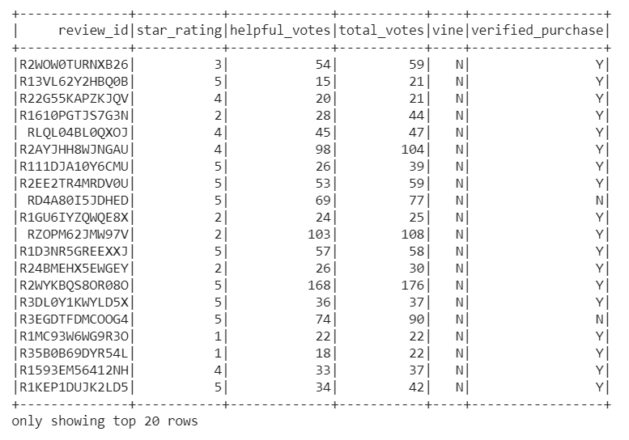

# Amazon Vine Analysis

## Overview of the Analysis

Today we are analysis datasets of Amazon reviews to determine if there is a positivity bias for Vine program members.

## Results

### Vine Results

- 613 reviews
- 222 5 star reviews
- 36.2% 5-star reviews

### Non-Vine Results

- 64,968 reviews
- 30,543 5-star reviews
- 47.0% 5-star reviews

## Summary

We have found no positivity bias for Vine reviews since the percentage of 5-star reviews for Vine reviewers is 36.2%, lower than the percentage of 5-star reviews for non-Vine reviewers of 47.0%. We should also analyze mean star ratings for Vine and non-Vine reviews.
